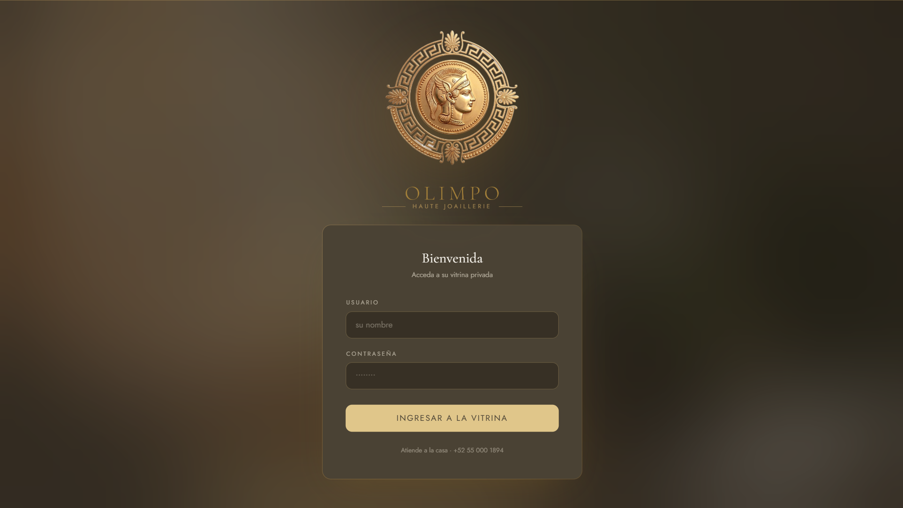
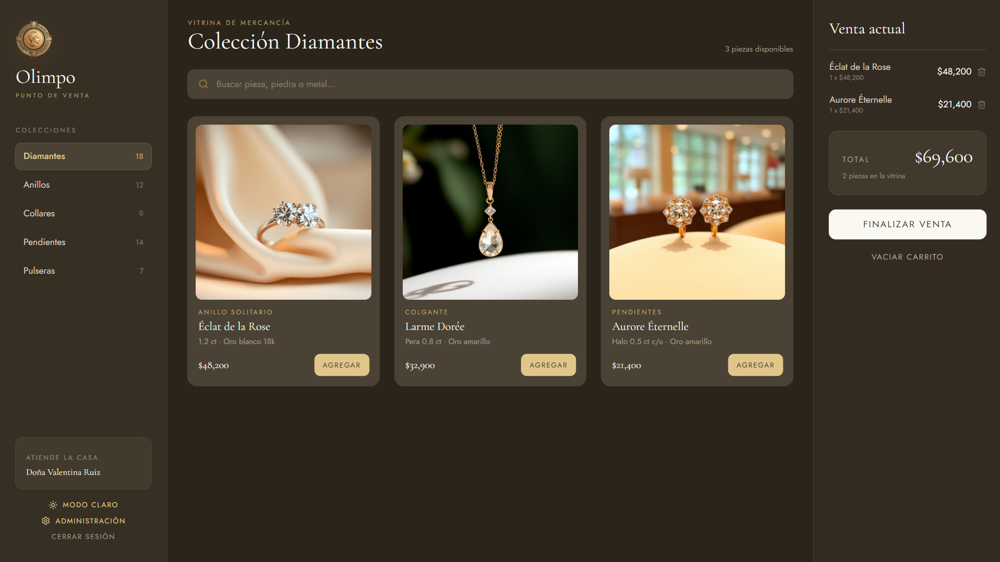
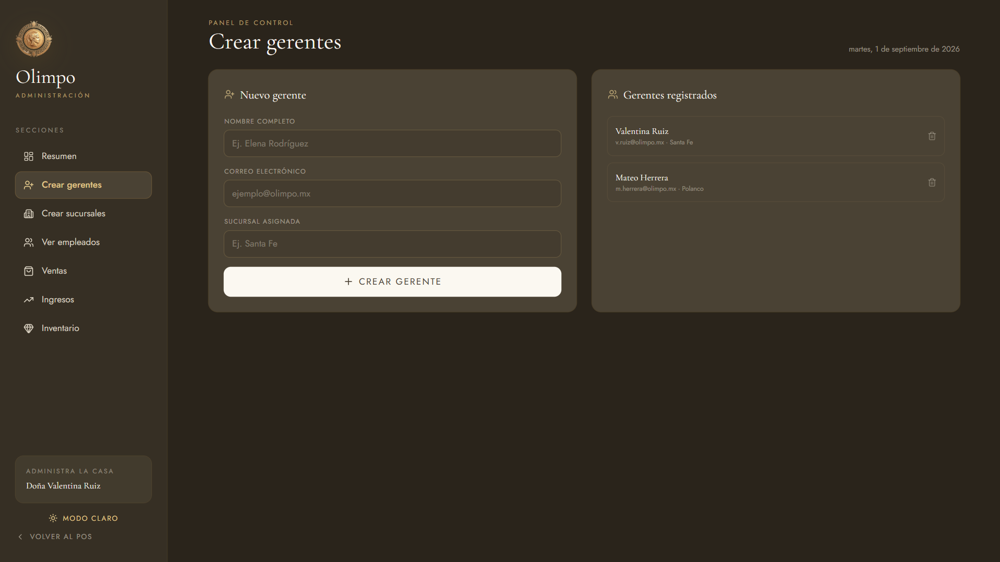
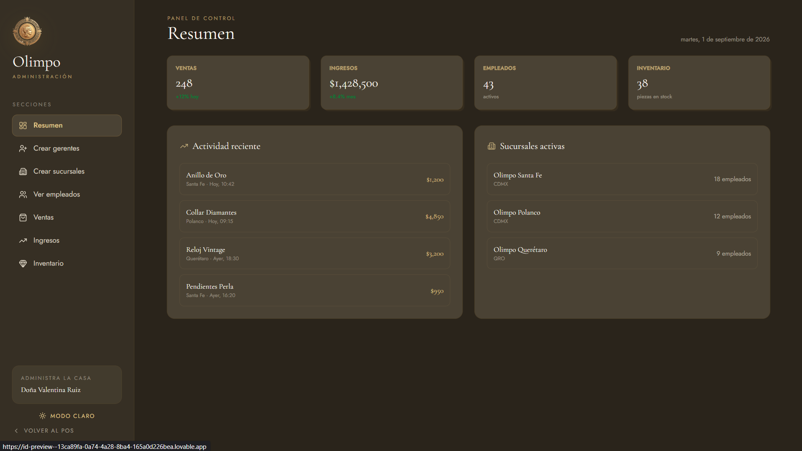

<div align="center">


# POS Olimpo

**Sistema web de Punto de Venta e Inventarios para joyerías**

Proyecto Integrador · Tercer Semestre · Ingeniería de Software

[](https://angular.dev)
[](https://www.typescriptlang.org)
[](https://nodejs.org)
[](https://www.postgresql.org)


</div>

---

## Descripción

Olimpo es un sistema web de punto de venta e inventarios diseñado **específicamente para joyerías**.

A diferencia de un punto de venta común, contempla las necesidades propias del giro: mercancía de alto valor donde cada pieza es distinta, precios que dependen de la cotización del metal, y apartados con calendario de abonos.

**Objetivo:** automatizar las ventas, el control de stock, el seguimiento de apartados y el control de accesos por roles.

---

## Capturas

<div align="center">

**Inicio de sesión**



<br>

**Vitrina de mercancía**



<br>

**Panel de administración**



<br>



</div>

---

## Módulos

| Módulo | Descripción |
|---|---|
| **Acceso** | Inicio de sesión y control por rol |
| **Productos** | Catálogo de piezas con peso, metal y quilataje |
| **Caja** | Registro de ventas |
| **Inventario** | Existencias y alertas de stock |
| **Apartados** | Anticipos y calendario de abonos |
| **Reportes** | Ventas, ingresos y auditoría |

---

## Tecnologías

| Capa | Tecnología |
|---|---|
| Frontend | Angular + TypeScript |
| Backend | Node.js + Express |
| Base de datos | PostgreSQL |
| Control de versiones | Git + GitHub |

---

## Instalación

```bash
git clone https://github.com/CharlieTech07/PUNTO-DE-VENTA-JOYERIA.git
cd PUNTO-DE-VENTA-JOYERIA
```

**Backend**

```bash
cd server
npm install
npm run dev
```

**Frontend**

```bash
cd client
npm install
npm start
```

---

## Metodología

Se trabaja con **Scrumban**: sprints cortos y un tablero Kanban de tres columnas —pendiente, en proceso y finalizado—. Cada integrante desarrolla en su propia rama y la integración se hace mediante pull requests.

---

## Equipo de desarrollo — Equipo 5

| Integrante | Rol |
|---|---|
| Carlos Arturo Argüellez Ruiz | Líder de equipo |
| Juan Amador Benítez | Desarrollo |
| Cristian Alexander Escobar Nuñez | Desarrollo |
| Jesús Enrique Ibarra Figueroa | Desarrollo |
| Alan Yakxel Juárez Cano | Desarrollo |

---

<div align="center">

Universidad de Colima · Facultad de Ingeniería Electromecánica

Ingeniería de Software · Grupo 3-E · Manzanillo, Colima

</div>


